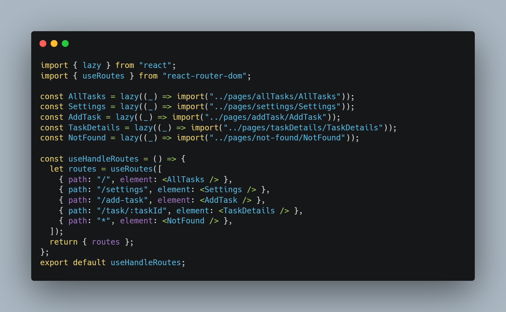

# Rahala Task 

I humbly apologize for the design and color palette—it's not exactly award-winning. Let's just say I'm "just a developer" and not a designer. My focus was on making things work, not making them pretty! 😅

Recently, I've been using a specific pattern in my projects that I find effective. You can find  it in this repository [React-Architecture](https://github.com/basemsala7/React-Architecture/) , 
I made sure to cover all the requirements and followed the specified approaches as closely as possible. Hopefully
Since the project is hosted on a free hosting service, you might experience some issues with speed

## Live Demo

You can view the live demo of the project at the following link:

[Live Demo](https://rahala-task.vercel.app/) 

## Technologies Used

- **React.js**: JavaScript library for building the user interface.
- **CSS**: For styling mobile first approach and css module.
- **React Router DOM**: A library for managing navigation and routing in React applications.
- **Axios**: A promise-based HTTP client for making API requests.
- **JSON Server** : A tool for creating a mock REST API for testing and development purposes.
- **React-Toastify** : A React library for displaying customizable toast notifications.


 ## Folder Structure 
```
 src/
 ├── assets/       # Stores all utilities fucntions , fonts and  images .
 ├── context/      # React Contexts for managing global state.
 ├── layout/       # Layout components such as headers, footers, and wrappers.
 ├── pages/        # Contains React components that represent different pages.
 ├── routes/       # Manages routing logic and navigation within the app.
 ├── components/   # all needer component 
```

## routes Folder 
```
routes/         
│   ├── routes.jsx

```
its custom hook using useRoutesHook with lazy loading and protected route and i mange all route in this file

 

## component folder structure

 ```
AddTask/         
│   ├── AddTask.jsx 
│   └── data.jsx 
|   |__ addTasks.module.css

```
I have separated the UI and   functionality by encapsulating the  logic into a custom hook named useDataGetter, which resides in the data.jsx file. This approach promotes a cleaner, more modular architecture by isolating the logic from the presentation layer. In the UI component, I import the useDataGetter hook and destructure its returned values (such as tasks , error, and the ) to manage the login state and handle tasks .

## Portal 

I used React Portal to create a popup modal for both delete and edit actions. This approach ensures better structure and flexibility when working with modals in the application.


